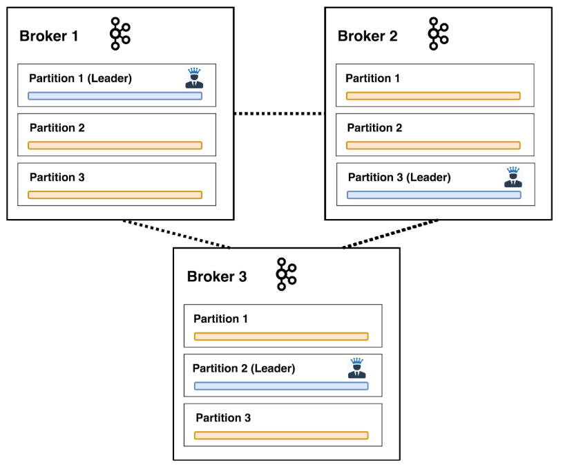
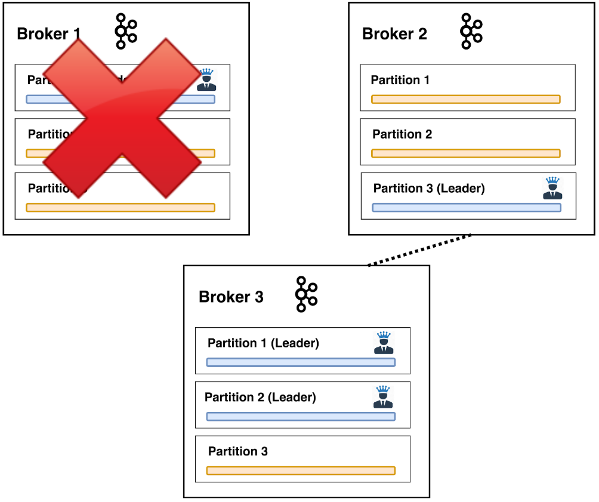
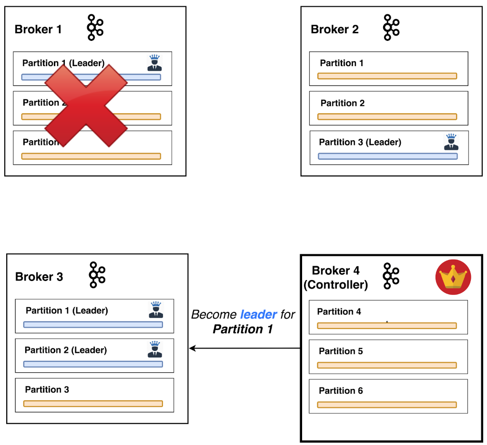

# Apache Kafka 101

---

# Hi

### I'm Viktor <!-- .element: class="fragment" -->

### Been in Paysafe for ~3 years 💳 <!-- .element: class="fragment" -->

### Part of team Horus 🐴<!-- .element: class="fragment" -->

Note:
- Risk / CMPL area

---

# Apache Kafka

...is a distributed streaming platform <!-- .element: class="fragment" -->

... distributed, parittioned, replicated, commit log service. <!-- .element: class="fragment" -->

---

## [What is it used for?](https://kafka.apache.org/uses)

- Messaging (like ActiveMQ / RabbitMQ) <!-- .element: class="fragment" -->
- Event sourcing (state as sequence of events) <!-- .element: class="fragment" -->
- Stream processing (incl. stateful) <!-- .element: class="fragment" -->
- Website activity tracking (high volume) <!-- .element: class="fragment" -->
- Log aggregation (splunk) <!-- .element: class="fragment" -->

---

# Why should you care 🤔?

MapR Streams are what we currently have. <!-- .element: class="fragment" -->

If they are to go anywhere, Kafka is the likely successor. <!-- .element: class="fragment" -->

---

### Kafka Fundamentals


- Messaging system semantics <!-- .element: class="fragment" -->
- Designed for clustering <!-- .element: class="fragment" -->
- Durability & Ordering guarantees <!-- .element: class="fragment" -->

---

### Kafka has four core APIs

 <!-- .element height="60%" width="60%" -->

----

# The Producer API 

allows an application to publish a stream of records to one or more Kafka topics <!-- .element: class="fragment" -->

----

# The Consumer API 

allows an application to subscribe to one or more topics and process the stream of records produced to them <!-- .element: class="fragment" -->

----

# The Streams API

allows an application to act as a stream processor <!-- .element: class="fragment" -->

Note: 
consuming an input stream from one or more topics and producing an output stream to one or more output topics, effectively transforming the input streams to output streams (in the sense of map/reduce) 

----

# The Connector API 

reusable producers or consumers that connect Kafka topics to existing applications or data systems <!-- .element: class="fragment" -->

Note:
allows building and running reusable producers or consumers that connect Kafka topics to existing applications or data systems. For example, a connector to a relational database might capture every change to a table.

---

## [The Kafka protocol](https://kafka.apache.org/protocol)

> Binary protocol over TCP

---

# How does it work

----

# Log

 <!-- .element: class="fragment" -->

An append-only, ordered, immutable sequence of records <!-- .element: class="fragment" -->

<div class="fragment">Each record is assigned a unique sequential number and consists of a **key**, a **value** and a **timestamp**</div>


Note:
Mention that reads and writes rae O(1) and do NOT lock

- git commit log
- application log, appending to end of file

Core structure for Kafka.
Mention that Kafka stores files on disk

----

# Topic

- Kafka stores records in topics <!-- .element: class="fragment" -->
- Topics are split into partitions <!-- .element: class="fragment" -->
- A partition is an append-only log of data records. <!-- .element: class="fragment" -->
- A rough representation using SQL would be: <!-- .element: class="fragment" -->
    - topic <=> table <!-- .element: class="fragment" -->
    - record <=> row <!-- .element: class="fragment" -->

----

# Topic


Note:
Each partition is an ordered, immutable sequence of records that is continually appended to — a structured commit log. The records in the partitions are each assigned a sequential id number called the offset that uniquely identifies each record within the partition.

The Kafka cluster durably persists all published records—whether or not they have been consumed—using a configurable retention period. For example, if the retention policy is set to two days, then for the two days after a record is published, it is available for consumption, after which it will be discarded to free up space. Kafka's performance is effectively constant with respect to data size so storing data for a long time is not a problem.

---

## Cluster of nodes (brokers)

<div>

<ul style="width: 40%; font-size: 70%">
    <li class=fragment> Brokers store multiple partitions of a topic  </li>
    <li class=fragment> Partitions are replicated for fault-tolerance </li>
    <li class=fragment> Broker can be a <b>leader</b> or a <b>follower</b> for a partition </li>
    <li class=fragment> Clients only use partition leaders</li>
</ul>
</div>

Note:
The partitions of the log are distributed over the servers in the Kafka cluster with each server handling data and requests for a share of the partitions. Each partition is replicated across a configurable number of servers for fault tolerance.

Each partition has one server which acts as the "leader" and zero or more servers which act as "followers". The leader handles all read and write requests for the partition while the followers passively replicate the leader. If the leader fails, one of the followers will automatically become the new leader. Each server acts as a leader for some of its partitions and a follower for others so load is well balanced within the cluster.

----

## Smart client, dumb broker

 <!-- .element class="fragment" height="50%" width="50%" -->

Note:
In fact, the only metadata retained on a per-consumer basis is the offset or position of that consumer in the log. This offset is controlled by the consumer: normally a consumer will advance its offset linearly as it reads records, but, in fact, since the position is controlled by the consumer it can consume records in any order it likes. For example a consumer can reset to an older offset to reprocess data from the past or skip ahead to the most recent record and start consuming from "now".

This combination of features means that Kafka consumers are very cheap—they can come and go without much impact on the cluster or on other consumers. 

The partitions in the log serve several purposes. First, they allow the log to scale beyond a size that will fit on a single server. Each individual partition must fit on the servers that host it, but a topic may have many partitions so it can handle an arbitrary amount of data. Second they act as the unit of parallelism.


---

# Producers

 <!-- .element: class="fragment" -->

The producer is responsible for choosing which record to assign to which partition within the topic. <!-- .element: class="fragment" -->

Note:
Producers publish data to the topics of their choice.
The producer is responsible for choosing which record to assign to which partition within the topic. This can be done in a round-robin fashion simply to balance load or it can be done according to some semantic partition function (say based on some key in the record).

---

# Consumers

<div>


<ul style="width: 50%; font-size: 70%">
    <li class=fragment> Consumers are labeled with a group name </li>
    <li class=fragment> Each record is delivered to one consumer instance within each group
        <ul>
            <li class=fragment> if all consumers have the same group, all record will be load balanced over the consumer instances</li>
            <li class=fragment> if all consumers have different groups, then each record will be broadcasted to all</li>
        </ul>
    </li>
</ul>
</div>

Note:
More commonly, however, we have found that topics have a small number of consumer groups, one for each "logical subscriber". Each group is composed of many consumer instances for scalability and fault tolerance. This is nothing more than publish-subscribe semantics where the subscriber is a cluster of consumers instead of a single process.

The way consumption is implemented in Kafka is by dividing up the partitions in the log over the consumer instances so that each instance is the exclusive consumer of a "fair share" of partitions at any point in time. This process of maintaining membership in the group is handled by the Kafka protocol dynamically. If new instances join the group they will take over some partitions from other members of the group; if an instance dies, its partitions will be distributed to the remaining instances.

Kafka only provides a total order over records within a partition, not between different partitions in a topic. Per-partition ordering combined with the ability to partition data by key is sufficient for most applications. However, if you require a total order over records this can be achieved with a topic that has only one partition, though this will mean only one consumer process per consumer group.

---

### Fault-tolerance

<div>

</div>

----

## Controller broker

<div>


<ul style="width: 40%; font-size: 70%">
    <li class=fragment> One controller per cluster </li>
    <li class=fragment> Any broker can be controller </li>
        <ul>
            <li class=fragment> Handles broker joinig/death/restart</li>
            <li class=fragment> Handles topic creation/deletion</li>
        </ul>
    </li>
</ul>
</div>

---

# ZooKeeper


---

## Delivery Guarantees

Producer <!-- .element: class="fragment" -->
- Async (No Guarantee) <!-- .element: class="fragment" -->
- Committed to Leader <!-- .element: class="fragment" -->
- Committed to followers <!-- .element: class="fragment" -->

Consumer <!-- .element: class="fragment" -->
- At-least-once <!-- .element: class="fragment" -->
- At-most-once <!-- .element: class="fragment" -->
- Effecively-once <!-- .element: class="fragment" -->

---


----

### SpringBoot - dependencies

`build.gradle`
```
dependencies {
    implementation 'org.springframework.kafka:spring-kafka'
}
```

----

### SpringBoot - producer

```java
@Service
public class MyProducer {
    @Autowired
    private KafkaTemplate<String, MyPayload> kafkaTemplate;

    public void sendMessage(MyPayload payload) {
        kafkaTemplate.send("topic-name", payload);
    }
}
```

----

### SpringBoot - consumer

```java

@Service
public class JsonstoreConsumer {

    @KafkaListener(topics = "topic-name")
    public void consume(MyPayload message) {
        // Money making code
    }
}
```

----

### Full demo here:

[https://github.com/viktorpenelski/spring-kafka-mongodb-demo/](https://github.com/viktorpenelski/spring-kafka-mongodb-demo/)

---

# [bg-kug.github.io](https://bg-kug.github.io/)

### Shameless plug

Join the Bulgarian kotlin usergoup mail list/group!

---

### Further reading:

- [Official introduction to Apache Kafka](https://kafka.apache.org/intro)
- [The Log: What every software engineer should know about real-time data's unifying abstraction](https://engineering.linkedin.com/distributed-systems/log-what-every-software-engineer-should-know-about-real-time-datas-unifying)
- [A Thorough Introduction to Apache Kafka](https://hackernoon.com/thorough-introduction-to-apache-kafka-6fbf2989bbc1)
- [Video: Introduction to Apache Kafka by James Ward](https://www.youtube.com/watch?v=UEg40Te8pnE)
- Book: Kafka The Definitive Guide (Safari books online)

---

# Thank you!