# Kotlin for Java Developers

---

### Who am I?

- Viktor 👨‍💻 <!-- .element: class="fragment" -->
- First internship - 2010 @ Orbitel <!-- .element: class="fragment" -->
- Took a small divergence to play professionally <!-- .element: class="fragment" -->
    - Poker ♦️♠️❤️♣️ <!-- .element: class="fragment" -->
    - League of Legend <!-- .element: class="fragment" -->
- Corporate experience as a backend Java developer (Paysafe, Falcon.io) <!-- .element: class="fragment" -->
- Started using Kotlin in 2017 <!-- .element: class="fragment" -->
    - IoT 9000 (Hackaton project) <!-- .element: class="fragment" -->
    - Gpaly Event (Android App) <!-- .element: class="fragment" -->
    - Bankerino (Springboot data aggregation) <!-- .element: class="fragment" -->

---

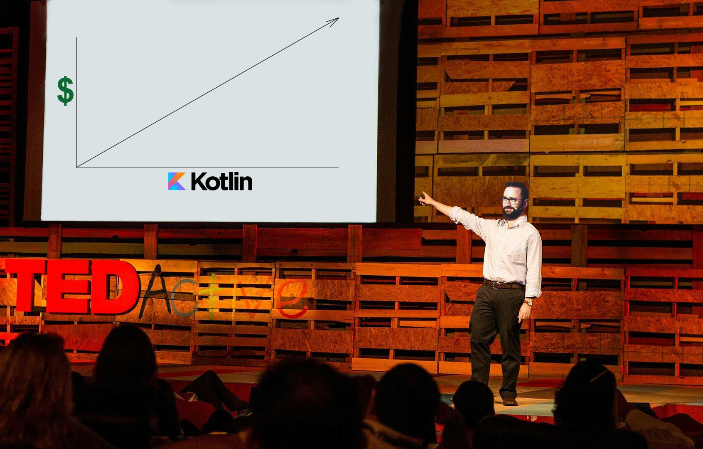

---

## Join BG-KUG!

[groups.io/g/bg-kug](https://groups.io/g/bg-kug)

---

# What is Kotlin?

An island near St. Petersburg <!-- .element: class="fragment" data-fragment-index="3" -->

    
    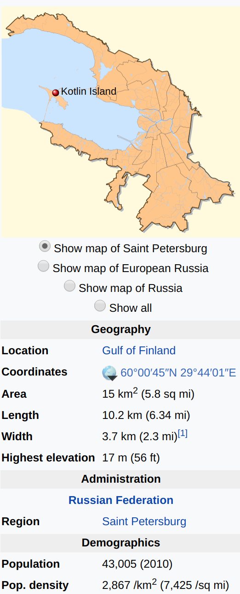

---

## What is Kotlin?

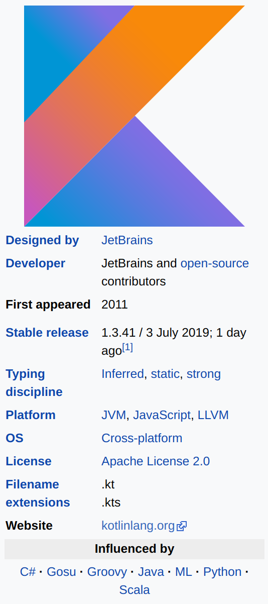
<ul style="width: 40%; font-size: 70%">
    <li class=fragment> An open sourced, statically typed programming language, maintained by the Kotlin Foundation, supported by JetBrains and Google  </li>
    <li class=fragment> A pragmatic language, driven with the developers and their tooling in mind </li>
    <li class=fragment> Compiles down to Java bytecode </li>
    <li class=fragment> .. as well as JavaScript and Native </li>
    <li class=fragment> Offers full interoperability with existing Java code </li>
</ul>

---

## A bit of history

----

#### [JetBrains unveil Project Kotlin - JVM language under development for a year](https://blog.jetbrains.com/kotlin/2011/07/hello-world-2/)

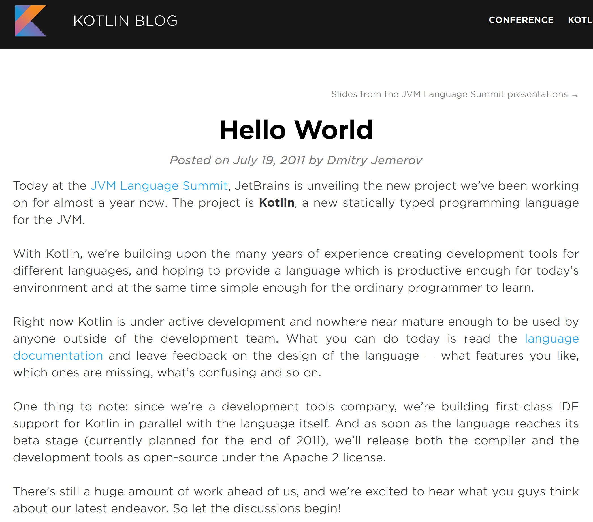

#### July 2011 

----

#### [Kotlin is open sourced under Apache 2](https://adtmag.com/articles/2012/02/22/kotlin-goes-open-source.aspx)

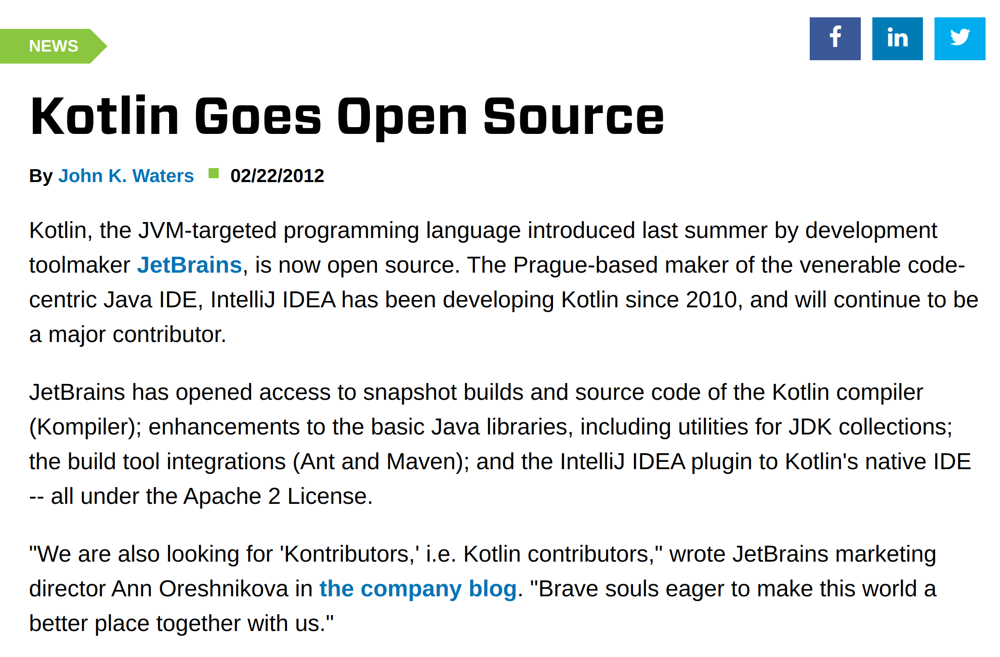

    <h4 style="color: grey">July 2011</h4>
    <h4>Feb 2012</h4>

----

#### [Kotlin v1.0 released](https://blog.jetbrains.com/kotlin/2016/02/kotlin-1-0-released-pragmatic-language-for-jvm-and-android/)

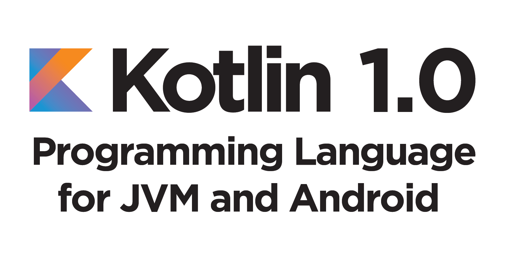

    <h4 style="color: grey">July 2011</h4>
    <h4 style="color: grey">Feb 2012</h4>
    <h4>Feb 2016</h4>

----

#### [Gradle announce `.kts` as an alternative to Groovy](https://blog.gradle.org/kotlin-meets-gradle)

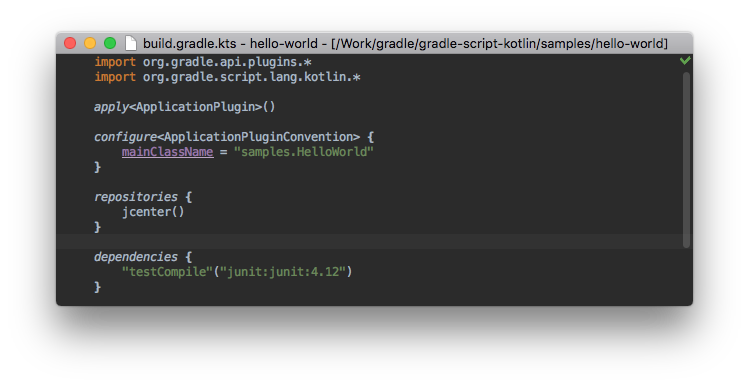

    <h4 style="color: grey">July 2011</h4>
    <h4 style="color: grey">Feb 2012</h4>
    <h4 style="color: grey">Feb 2016</h4>
    <h4>May 2016</h4>

----

#### [Kotlin v1.1 - JavaScript as a stable target](https://blog.jetbrains.com/kotlin/2017/03/kotlin-1-1/)

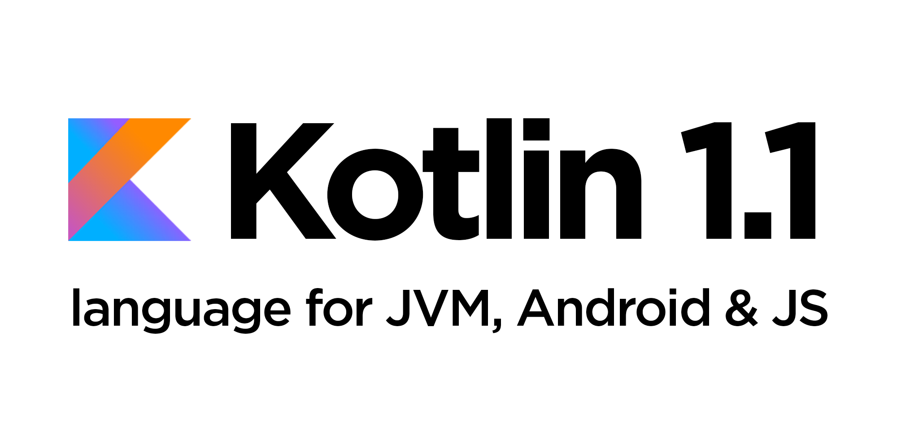

    <h4 style="color: grey">July 2011</h4>
    <h4 style="color: grey">Feb 2012</h4>
    <h4 style="color: grey">Feb 2016</h4>
    <h4 style="color: grey">May 2016</h4>
    <h4>Mar 2017</h4>

----

#### [Google announce first-class support for Kotlin](https://blog.jetbrains.com/kotlin/2017/05/kotlin-on-android-now-official/)

    <h4 style="color: grey">July 2011</h4>
    <h4 style="color: grey">Feb 2012</h4>
    <h4 style="color: grey">Feb 2016</h4>
    <h4 style="color: grey">May 2016</h4>
    <h4 style="color: grey">Mar 2017</h4>
    <h4>May 2017</h4>

----

#### [Kotlin v1.3 - stable coroutines API](https://kotlinlang.org/docs/reference/whatsnew13.html)

    <h4 style="color: grey">July 2011</h4>
    <h4 style="color: grey">Feb 2012</h4>
    <h4 style="color: grey">Feb 2016</h4>
    <h4 style="color: grey">May 2016</h4>
    <h4 style="color: grey">Mar 2017</h4>
    <h4 style="color: grey">May 2017</h4>
    <h4>Oct 2018</h4>

----

#### [JetBrains and Google co-announce the Kotlin Foundation](https://kotlinlang.org/foundation/kotlin-foundation.html)

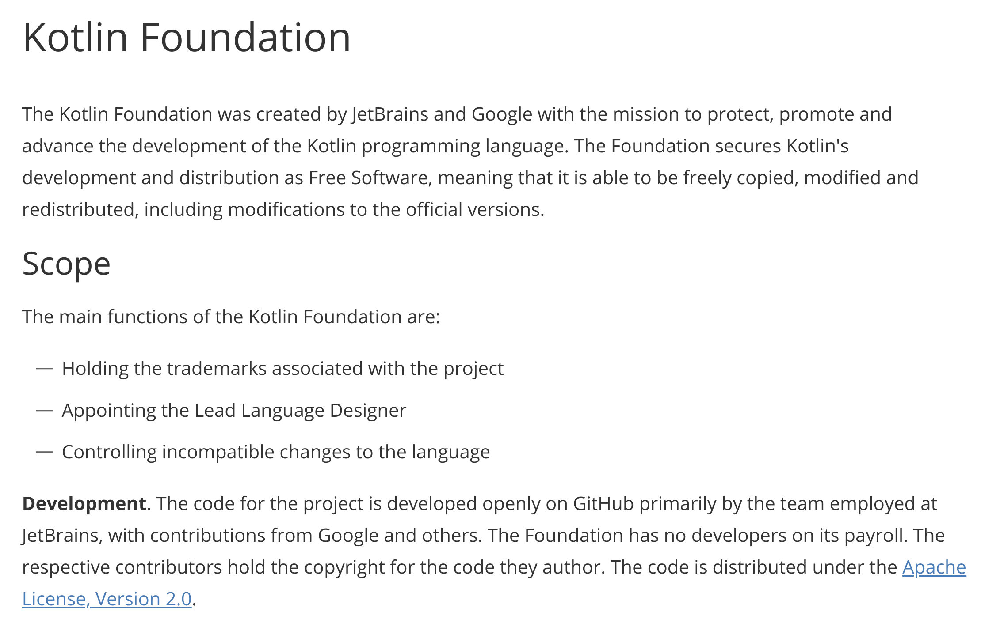

    <h4 style="color: grey; float: left;">July 2011</h4>
    <h4 style="color: grey">Feb 2012</h4>
    <h4 style="color: grey">Feb 2016</h4>
    <h4 style="color: grey">May 2016</h4>
    <h4 style="color: grey">Mar 2017</h4>
    <h4 style="color: grey">May 2017</h4>
    <h4>Oct 2018</h4>

----

#### [Google announce Kotlin first Android development](https://android-developers.googleblog.com/2019/05/google-io-2019-empowering-developers-to-build-experiences-on-Android-Play.html)

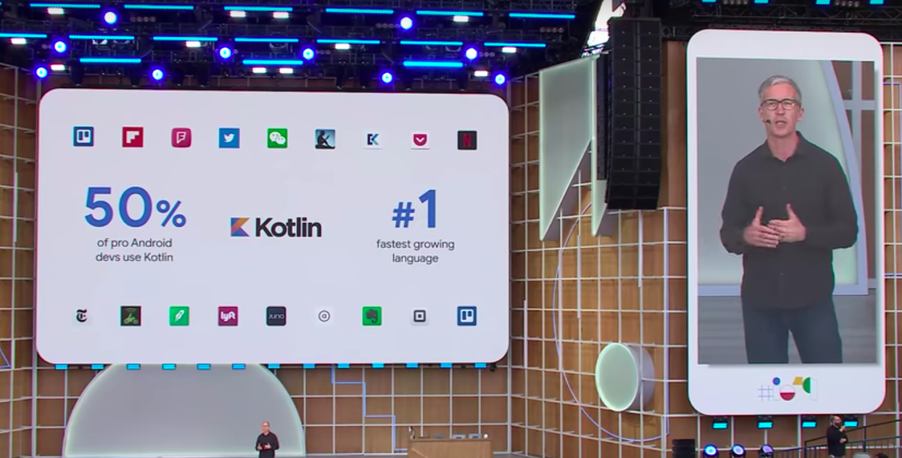

    <h4 style="color: grey">July 2011</h4>
    <h4 style="color: grey">Feb 2012</h4>
    <h4 style="color: grey">Feb 2016</h4>
    <h4 style="color: grey">May 2016</h4>
    <h4 style="color: grey">Mar 2017</h4>
    <h4 style="color: grey">May 2017</h4>
    <h4 style="color: grey">Oct 2018</h4>
    <h4>May 2019</h4>

----

#### [Spring 5.2 with first-class support for Coroutines](https://spring.io/blog/2019/09/30/spring-framework-5-2-goes-ga)

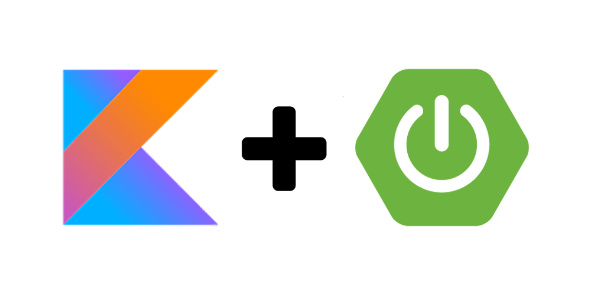

    <h4 style="color: grey">Feb 2012</h4>
    <h4 style="color: grey">Feb 2016</h4>
    <h4 style="color: grey">May 2016</h4>
    <h4 style="color: grey">Mar 2017</h4>
    <h4 style="color: grey">May 2017</h4>
    <h4 style="color: grey">Oct 2018</h4>
    <h4 style="color: grey">May 2019</h4>
    <h4>Sep 2019</h4>

---

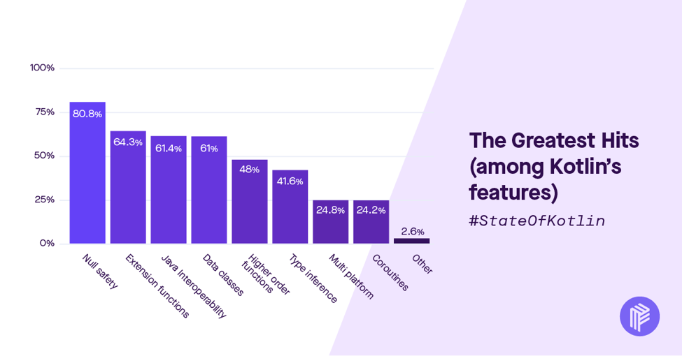

---

# Demo

<!-- TODO(vic): Picture prayer to the demo gods -->

Note:
- Main and basic syntax
- Null safety
- String interpolation
- Data classes
- Java interop
- Higher order functions

---

# A few prod stories

----

# [Uber](https://eng.uber.com/measuring-kotlin-build-performance/)

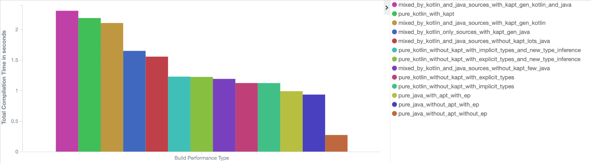 <!-- .element: class="fragment" -->

----

# Uber

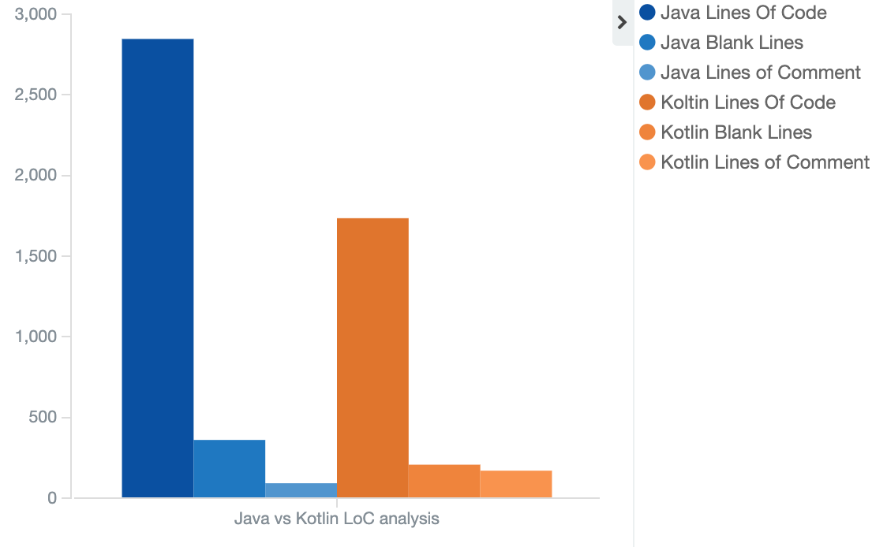 <!-- .element: class="fragment" -->

----

# Uber

>  In a recent internal survey at Uber, we asked nearly 100 mobile engineers if they were willing to accept slower build times in order to be able to use Kotlin. The result? 95 percent have said that they would be willing to accept slower builds if they could write their code in Kotlin.

---

# [Khan Academy](https://engineering.khanacademy.org/posts/kotlin-adoption.htm)

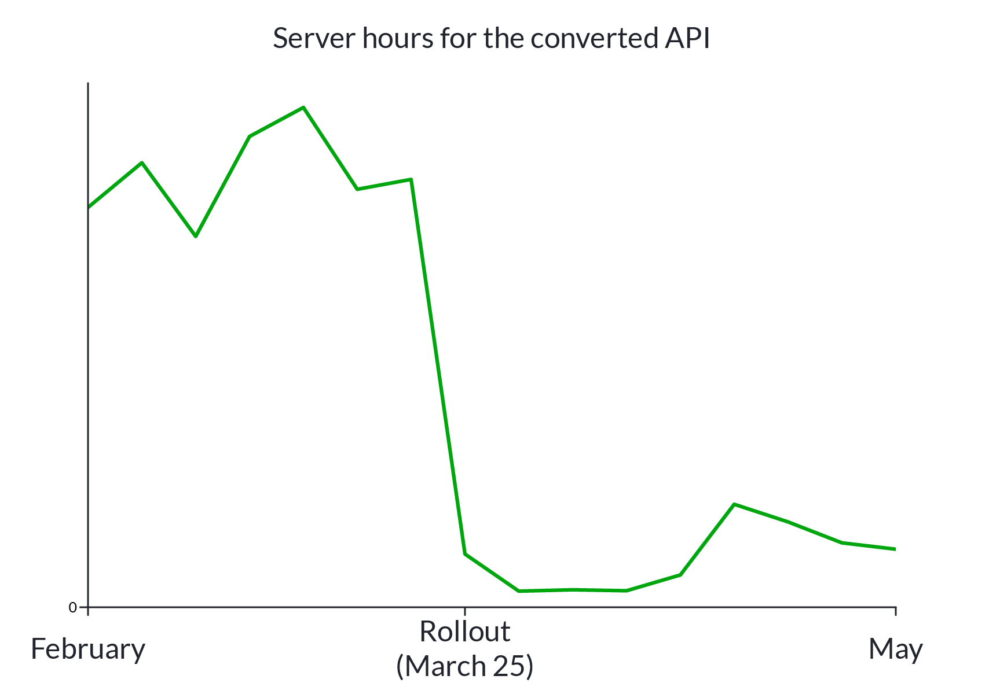

 <!-- .element: class="fragment" -->

---

### Why Kotlin?

- It is free and open source <!-- .element: class="fragment" -->
- You can easily mix Kotlin and Java <!-- .element: class="fragment" -->
    - Keep using existing java frameworks/libraries <!-- .element: class="fragment" -->
- Kotlin is easy to read, even non-kotlin devs can do code review for it <!-- .element: class="fragment" -->
- Comes from the industry <!-- .element: class="fragment" -->
    - JetBrains actively uses it in their money-making products <!-- .element: class="fragment" -->
    - Tooling is a core priority <!-- .element: class="fragment" -->
    - Google is backing it up <!-- .element: class="fragment" -->

---

## Join BG-KUG!

[groups.io/g/bg-kug](https://groups.io/g/bg-kug)

---

# Thank you!