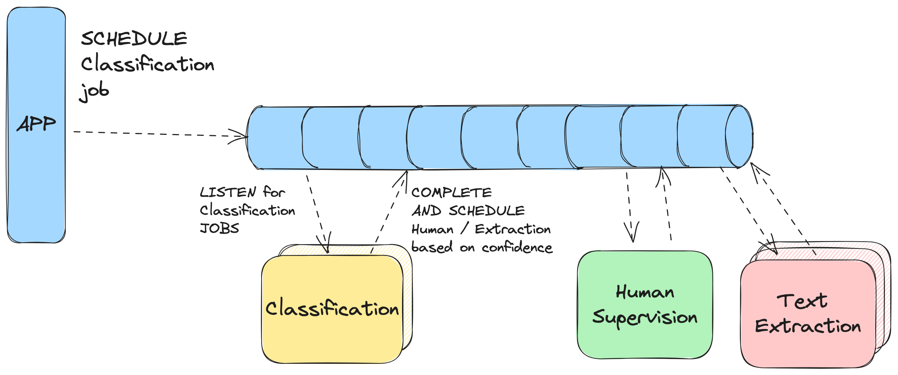

## Orchestrating our ML platform

#### Or how we ended up writing a workflow engine

04.04.2024, Viktor Penelski

 <!-- .element height="300px"  -->

We are hiring!
Thanks Dev.BG

---

## Who am I

 <!-- .element height="500px" -->

**Viktor Penelski**

Staff Software Engineer @ Hyperscience  <!-- .element style="font-size: 0.60em" -->

💻 coding since 2006

♠️ Used to play Poker and League of Legends competitively

🕺Swing Dancing

👨‍💻 Working on our internal workflow engine implementation for the past ~3 years  

Note:
-

---

# Agenda

- What problem are we solving
- How we ended up with a Workflow Engine architecture <!-- .element class="fragment" -->
- What is a workflow engine <!-- .element class="fragment" -->
- ... and the story of how we ended up writing our own <!-- .element class="fragment" -->

---

# Anti-agenda

- Not about model architecture or training <!-- .element class="fragment" -->
- Not going to sell you on "THE ONLY RIGHT WAY" <!-- .element class="fragment" -->

Note:

---

# The problem

Note:
- We have an ML platform 
- performs various tasks like Classification of documents and data extraction
- REAL EXAMPLE - Insurance Claims (Car, Medical)
- Human in the Loop (SLAs)

----

----

## Architecture

peer-to-peer choreography <!-- .element class="fragment"  -->

  <!-- .element class="fragment fade-in-then-out" style="position:absolute;top:0;left:0;" -->

  <!-- .element class="fragment fade-in-then-out" style="position:absolute;top:0;left:0;"-->

  <!-- .element class="fragment fade-in-then-out" style="position:absolute;top:0;left:0;"-->

Note:
One way to implement such a platform would be using p2p choreography - the "traditional" approach
where services call eachother.
This has some advantages, more notable:
- easy to grasp
- decentralized architecture

Some major disadvantages as well:
- potential for cascading failure when one service is down
- routing and discovery (load balanceers) - nowadays with platdorms like Kubernetes this is probably easier than ever,
but still requires additional architectural complexity
- hard to know "how far along" is a certain call chain (e.g., imagine there are ~20 distinct steps)
- making changes to the process involves code changes in multiple services, while decentralized,
this introduces tight coupling

----

## Architecture

message queue

Note:
pretty standard architecture in distributed systems
advantages:
- a durable message queue allows for consumers to scale/fail/recover without losing data
- scaling by just adding additional consumers
We had a similar implementation using "job queues", won't go into details, but we had different types
of machines for different workloads and they were picking up tasks and working on them (funcall, slow funcall)

---

# The requirements

- Make it easy to customize the process
- ...both for ourselves, but also for 3rd parties <!-- .element class="fragment"  -->
- 

Notes:
- Currently, the "set of tasks and their order" is pretty "hardcoded" as code in the platform
- We want to be able to change the order of task/job/service execution, without having to do platform code changes
- We want to allow our customers (and partners) to implement changes without having to rebuild our platform
- our platform ships on-premise. So for some companies, updating can be a slow and tedious process.
- Some features don't make sense for the platform in the first place. We still want to cater
to customization requests for customers, but keeping non-core features separate from the platform is a must
Value added for partners

---

# Workflows

<section data-background="./images/idp_38.png">

---

# Hyperflow

  <!-- .element class="fragment fade-in-then-out" style="position:absolute;top:0;left:0;" -->

Note:
show complex diagram of system components. Say it will make sense by the end of the presentation

---

# Concepts

- flow definition (workflow definition)
- block definition (task/job definition)
- blocks (workers, [micro]services)
- workflow engine (orchestrator)
- UI

----

# Flow Definition

 <!-- .element height="500px" -->

Note:
json-based blueprint.
Defines a series of tasks that will be executed.
The tasks can either represent "control flow tasks" (e.g., conditionals, forks),
or worker tasks.
The json-based blueprint was a key design decision we were intentional about, as it allows us to build a language-agnostic base that can be targeted from any sdk or potentially a UI builder.
We currently support a python-sdk, as our research showed that was our main target audience (e.g., python developers), as any customization would currently be in the form of python code anyway.

----

# Block Definition

## and block executables

 <!-- .element height="500px" -->

Note:
Blocks (tasks, jobs)
- System blocks - ran directly inside the engine (Lambda, Decision, Fork)
- Other blocks - separate services (e.g., Classification, Text Extraction) 
- FORK: lower latency

----

# Workflow Engine

  <!-- .element class="fragment fade-in-then-out" style="position:absolute;top:0;left:0;" -->

  <!-- .element class="fragment fade-in-then-out" style="position:absolute;top:0;left:0;" -->

Note:
State machine. 
Combines the blueprint (workflow definition) with the current state
of the workflow (workflow instance). Identifies the next state. Schedules next tasks and/or updates the workflow status.

---

<section data-background="images/idp_38.png" data-background-size="contain">
<h3>UI: Flow Definition</h3>
</section>

---

<section data-background="images/pii-flow.png" data-background-size="contain">
<h3>UI: Flow Definition</h3>
</section>

---

## UI: Flow Runs (list)

<section data-background="images/flow-runs-list.png" data-background-size="contain">
</section>

---

<section data-background="images/failed-flow-run.png" data-background-size="contain">
<h2>UI: Flow Run (details) </h2>
</section>

---

# Alternatives

- [Netflix Conductor](https://conductor.netflix.com/)
- [Amazon SWS](https://docs.aws.amazon.com/amazonswf/latest/developerguide/swf-welcome.html)
- [Apache Airflow](https://airflow.apache.org/)
- [Azkaban](https://azkaban.github.io/)
- [Luigi](https://github.com/spotify/luigi)

Note:
Netflix Conductor was closest to our requirements, in particular, being storage agnostic and utilizing blueprint-based definitions.

Most of the other solutions were not a good fit, as they either did not utilize blueprint-based definitions, were coupled with either a cloud provider or with a particular technology.

---

# Story time

<section data-background="images/pexels-james-wheeler-3774243.jpg">

Note:
Initially, we integrated with netflix conductor and planned to use the Open Source orchestrator for our SaaS deployments. However, we had to also build an api-compatible internal implementation for our on-premise customers.
The reason being that for some enterprises, provisioning databases can be... challenging. Which is why our deployment is usually just a single SQL DB, an image store (e.g., S3) and VMs running our application. While on cloud instances, we could provision any infra we wanted, for on-prem we had to adhere to these constraints
Over time, it turned out that using only hyperflow is easier in multiple ways:
- knowledge - in case of issues, the developer troubleshooting doesn't need to have knowledge of two systems
- operational - load testing, deployment knowhow
- evolution - features that require brekaing changes not supported by netflix conductor.

---

## Stats

|   |   |
|:---|:---:|
| EC2 instances (m5.4xlarge) | 50 |
| DB (db.m5.8xlarge) | 15k IOPS |
| CPU cores |  800  |
| RAM | ~3000 GiB | 
| Throughput (pages) | ~2.2MM  |
| Throughput (flow runs) | ~10MM |

Note:
Optimizing for our usecase
- while we have abstracted the wfe in a way allowing us to scale (e.g., MQ, sharding), having our own service allows us to optimize for the common usecase (single DB + image store), 
TODO: latency vs. througput

---

# Recap <!-- .element style="color: white;" -->

<section data-background="images/steam-train.jpeg">

Notes:
- Do you need a workflow engine?
- It depends.. For most application development usecases (outside of "big data" pipelnies), probably not;
- unless you have requirements similar to ours or business processes within your organization that need to be traced.
- EXAMPLES: Slack, Github

- Should you build a workflow engine?
- Again, it depends :shrug: If you control your own infrastrucutre, probably using an off-the-shelf solution is your best bet.

<!-- ---

## Some cool things we tried

- [hacked] an audio ingestion
- better throughput using an actual MQ
- partial DB sharding -->

---

# Thank you! <!-- .element style="color: white;" -->

<section data-background="images/milky-way.jpg">

  
 <!-- .element height="300px" .element class="fragment"  -->

blog post <!-- .element class="fragment" -->
[shorturl.at/ruvwy](https://www.hyperscience.com/blog/orchestrating-our-ml-platform/) <!-- .element class="fragment" -->

